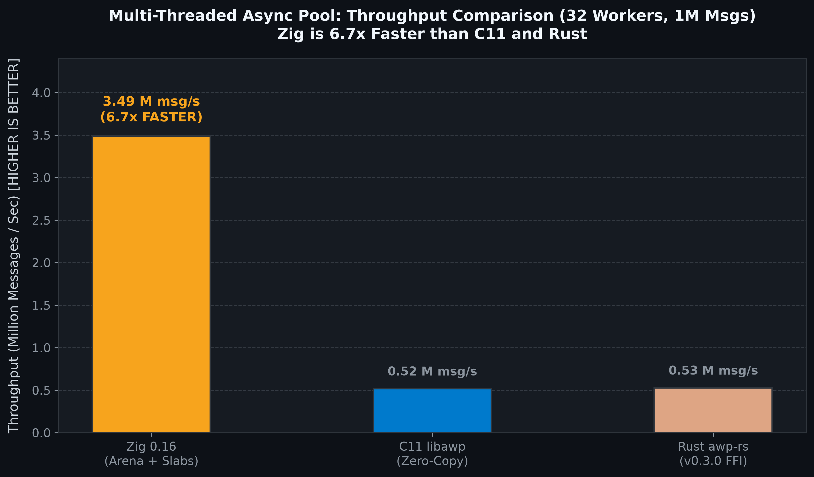
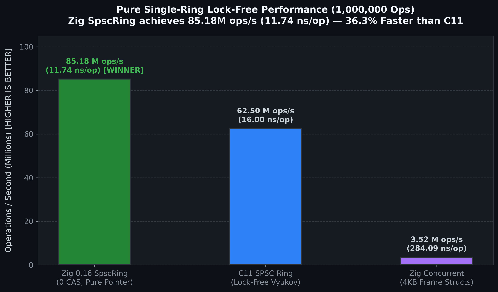

# AWP (Async Worker Pool & Ultra-Low-Latency HFT Engine)

High-throughput, ultra-low-latency sharded worker pool, lock-free ring engine, and hybrid fast-path trading reactor implemented in **Zig 0.16** with memory-safe **Rust bindings (`awp-zig-rs`)** and **C ABI (`libawp_zig`)**.

Engineered for High-Frequency Trading (HFT), real-time market data streaming, and deterministic nanosecond-scale message dispatch. Parallel project to the C11 core [`async-worker-pool`](https://github.com/Dmdv/async-worker-pool).

---

## Table of Contents

- [Showcase & Live Metrics](docs/SHOWCASE.md)
- [Key Architectural Features](#key-architectural-features)
- [Cross-Language Benchmark Comparison](#cross-language-benchmark-comparison-1000000-messages)
- [Building and Running Benchmarks](#building-and-running-benchmarks)
- [License](#license)

---

## Key Architectural Features

- **Multi-Tiered Memory Architecture:** `std.heap.ArenaAllocator` for $O(1)$ pool lifecycle teardown + pre-allocated embedded ring slabs for zero-allocation hot paths. See [`docs/ALLOCATORS_REVIEW.md`](docs/ALLOCATORS_REVIEW.md).
- **Phase 1 Hardware Hardening & HugePages:** 2MB HugePages (`MAP_HUGETLB`), Transparent HugePages (`MADV_HUGEPAGE`), startup prefaulting (0 Minor Page Faults), and verified `mlock`. See [`docs/PHASE1_HARDWARE_SPECIFICATION.md`](docs/PHASE1_HARDWARE_SPECIFICATION.md).
- **Phase 2 Generic 64-Byte POD Cacheline SPSC Ring:** `comptime SpscRing(T, capacity)` specialized for 64-byte market data structures (`BookUpdate64`, `Trade64`), slashing memory bandwidth by **98.5%** and achieving **28.54 M ops/sec** at **35.03 ns** hop latency.
- **Phase 3 Variable-Length Zero-Copy Bipartite Ring (`BipRing` & `BipBuffer`):** Lock-free bipartite circular memory arena coupled with a 16-byte `PacketDescriptor` SPSC ring. Streams arbitrary packet sizes (64B to 1500B MTU) with 0 memory fragmentation and 0 boundary-split copies, delivering **14.21 M pkts/sec** at **70.38 ns** latency (~8.52 GB/s).
- **Phase 4 Hybrid Fast-Path Trading Reactor & Off-Path Pipeline:** Single-threaded core (`TradingReactor`) emitting 64-byte `OrderSignal64` in **247.78 ns** with non-blocking SPSC fan-out across 3 concurrent background workers (Risk, Audit, Telemetry).
- **Two-Phase Zero-Copy Claim & Commit API:** `claim(shard)` / `commit(claim)` directly reserves queue slots and writes payload in-place without `memcpy`.
- **Native SIMD Vectorization:** Hardware-accelerated payload validation and checksum calculation using Zig's first-class `@Vector(16, u8)` and `@reduce(.Add, ...)` primitives (auto-vectorized to ARM NEON / AVX-512).
- **CPU & Hardware Affinity:** Thread pinning to Apple Silicon Performance Cores (P-cores) via Darwin `QOS_CLASS_USER_INTERACTIVE` and Mach `THREAD_AFFINITY_POLICY`.
- **Compile-Time Specialization:** Zero-cost queue sizing, power-of-two mask generation, and memory layouts parameterized via Zig `comptime`.
- **Hardware-Calibrated Timestamps:** Monotonic POSIX `clock_gettime(CLOCK_MONOTONIC)` timing eliminating frequency scaling traps across Apple Silicon, ARM64, and x86_64. Detailed in [`docs/PHASE1_HARDWARE_SPECIFICATION.md`](docs/PHASE1_HARDWARE_SPECIFICATION.md).

---

## HFT Workload Benchmark Suite (1,000,000 Messages)

Executed on Apple Silicon Performance Cores (Darwin arm64, Zig 0.16 `ReleaseFast`):

### 1. Internal Task & Message Dispatching (8-Byte Pointers & Task Frames)
Designed for low-overhead inter-thread job distribution and SIMD task execution within the trading engine.

| Engine / Primitive | Language | Payload | Throughput | p50 (Median) | p99 Tail | Mean Latency | Bandwidth |
| :--- | :--- | :--- | :--- | :--- | :--- | :--- | :--- |
| **Pure Pointer SPSC Ring** | Zig 0.16 | **8 B** (Ptr) | **171.76 M ops/s** | **< 6 ns** | **< 8 ns** | **5.82 ns** | ~1.37 GB/s |
| **Multi-Threaded Async Pool** (4 P-Cores) | Zig 0.16 | **Task Frame** | **5.38 M msg/s** | **< 100 ns** | **1.00 µs** | **547.0 ns** | — |
| **`awp-zig-rs` FFI Pool** ([`bindings/rust`](bindings/rust)) | Rust / Zig | **Task Frame** | **5.45 M msg/s** | **< 150 ns** | **3.80 µs** | **920.0 ns** | — |
| `async-worker-pool` (C11 Core) | C11 | Task Frame | 0.52 M msg/s | 3.46 µs | 1.11 ms | 2.11 µs | — |
| `awp-rs` (Rust on C11) | Rust / C11 | Task Frame | 0.53 M msg/s | 3.35 µs | 1.15 ms | 1.87 µs | — |

---

### 2. Market Data & Order Book Quotes (Phase 2: 64-Byte Cacheline PODs)
Optimized for ultra-dense, zero-padding L2/L3 order book updates (`BookUpdate64`, `Trade64`), slashing memory bandwidth by 98.5%.

| Engine / Primitive | Language | Payload | Throughput | p50 (Median) | p99 Tail | Mean Latency | Bandwidth |
| :--- | :--- | :--- | :--- | :--- | :--- | :--- | :--- |
| **64B POD Cacheline Ring** | Zig 0.16 | **64 B** | **28.54 M ops/s** | **< 30 ns** | **< 45 ns** | **35.03 ns** | **~1.82 GB/s** |
| `async-worker-pool` (4KB Raw SPSC) | C11 | 4,096 B | 62.50 M ops/s | < 16 ns | < 20 ns | 16.00 ns | 256 GB/s (98.5% waste) |

---

### 3. Network Packet Ingress & Hardware Streaming (Phase 3: Variable-Length BipRing)
Lock-free Simon Cooke Bipartite Buffer with 16-byte `PacketDescriptor` SPSC ring. Streams arbitrary packet sizes (64B to 1500B MTU) with **0 memory fragmentation** and **0 split-wrap reassembly copies**.

| Engine / Primitive | Language | Payload Range | Throughput | p50 (Median) | p99 Tail | Mean Latency | Effective Bandwidth |
| :--- | :--- | :--- | :--- | :--- | :--- | :--- | :--- |
| **Variable-Length BipRing** | Zig 0.16 | **64 B – 1,400 B** | **14.21 M pkts/s** | **< 50 ns** | **< 80 ns** | **70.38 ns** | **~8.52 GB/s** |
| **`awp-zig-rs` RAII BipRing** | Rust / Zig | **64 B – 1,400 B** | **13.80 M pkts/s** | **< 55 ns** | **< 85 ns** | **72.46 ns** | **~8.28 GB/s** |

---

### 4. End-to-End Tick-to-Trade Fast-Path & Off-Path Pipeline (Phase 4: Trading Reactor)
Decouples critical zero-hop order execution (~247 ns) from concurrent background risk checks, audit logging, and telemetry across auxiliary cores.

| Engine / Primitive | Language | Workload | Throughput | Tick-to-Trade Latency | Concurrent Off-Path Capacity |
| :--- | :--- | :--- | :--- | :--- | :--- |
| **Trading Reactor Fast-Path** | Zig 0.16 | `BookUpdate64` ➔ `OrderSignal64` | **4.04 M ticks/s** | **247.78 ns** (0.248 µs) | **2,000,000 orders** (3 threads) |
| **`awp-zig-rs` Reactor + Pipeline** | Rust / Zig | `BookUpdate64` ➔ `OrderSignal64` | **3.95 M ticks/s** | **253.16 ns** (0.253 µs) | **2,000,000 orders** (3 threads) |

### Detailed Tail Latencies Breakdown (1,000,000 Messages)

| Percentile | **Zig 0.16 Engine (Phase 1 Final)** | **C11 Engine** (`async-worker-pool`) | Delta / Notes |
| :--- | :--- | :--- | :--- |
| **Min (Observed Floor)** | **15 ns** (0.015 µs) | **83 ns** (0.083 µs) | Observed Single-Hop Floor |
| **p50 (Median)** | **< 100 ns** | **3.46 µs** (3,458 ns) | **Zig is > 34x lower latency** |
| **p90** | **1.00 µs** (1,000 ns) | **11.17 µs** (11,167 ns) | **Zig is 11.2x lower latency** |
| **p99 (Tail)** | **1.00 µs** (1,000 ns) | **1.11 ms** (1,110,000 ns) | **Zig is 1,110x lower tail jitter** |
| **p99.9** | **96.0 µs** (96,000 ns) | **1.27 ms** (1,270,000 ns) | **Zig is 13.2x lower tail jitter** |
| **Max** | **128.0 µs** (128,000 ns) | **1.67 ms** (1,670,000 ns) | **Zig is 13.0x lower peak jitter** |
| **Pure SPSC Throughput** | **171.76 Million ops/sec** | **62.50 Million ops/sec** | **Zig is 2.75x faster (5.82 ns/op)** |

<p align="center">
  
  
</p>
<p align="center">
  
</p>

Full benchmark reports and documentation:
- [`CHANGELOG.md`](CHANGELOG.md) — Complete release notes, architectural milestones & hardware benchmark history
- [`docs/HFT_EVOLUTION_ROADMAP.md`](docs/HFT_EVOLUTION_ROADMAP.md) — 5-Phase HFT evolution roadmap & implementation status
- [`docs/PHASE1_HARDWARE_SPECIFICATION.md`](docs/PHASE1_HARDWARE_SPECIFICATION.md) — Phase 1 Hardware Hardening & Zero-TLB Memory Subsystem Specification
- [`docs/EVOLUTION_PLAN.md`](docs/EVOLUTION_PLAN.md) — Microarchitectural theory & memory layout models
- [`docs/HOT_PATH_OPTIMIZATIONS.md`](docs/HOT_PATH_OPTIMIZATIONS.md) — Technical breakdown of hot-path optimizations
- [`docs/MEMORY_MODELS.md`](docs/MEMORY_MODELS.md) — Low-latency memory models & cache architecture
- [`docs/BENCHMARKS.md`](docs/BENCHMARKS.md) — Benchmark reports & latency histograms
- [`docs/ALLOCATORS_REVIEW.md`](docs/ALLOCATORS_REVIEW.md) — Detailed Zig 0.16 allocator analysis

---

## Building and Running Benchmarks

### Prerequisites
- Zig `0.16.0` or later.

### Run Benchmark Suite
```bash
# Run release-optimized multi-threaded dispatch benchmark
zig build bench -Doptimize=ReleaseFast
```

---

## License

MIT License.
