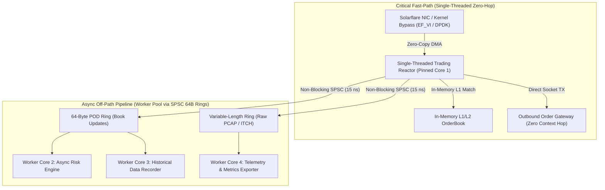

# HFT Evolution Roadmap: Ultra-Low-Latency Architecture (Zig 0.16 & Rust)

---

## Executive Summary & Engineering Thesis

In Tier-1 High-Frequency Trading (FX, Equities, Crypto Market Making) with sub-microsecond Tick-to-Trade constraints:
1. **The Critical Path MUST be Single-Threaded & Zero-Hop:** Multi-threaded worker pools are eliminated from the direct order-execution loop because inter-core cache synchronization (L3 cacheline invalidation via MESI/MOESI) imposes an unavoidable **100–300 ns physical penalty**.
2. **Fixed 4KB Payloads MUST Evolve to 64-Byte Flat Cacheline PODs & Variable Slices:** Passing 4264-byte generic frames for 32-byte market updates consumes excessive memory bandwidth (~4.2 GB/s per 1M msg/s).
3. **The Role of the Async Worker Pool:** The pool serves as the **Asynchronous Off-Path Pipeline** (Order Book Rebuilders, Multi-Asset Risk Engines, Real-time Logging, and Prometheus Telemetry), decoupled from the Reactor core via lock-free, zero-CAS SPSC rings.

---

## Architecture Topology



---

## Evolution Phases & Implementation Milestones

### Phase 1: Generic 64-Byte Cacheline POD Ring (`comptime SpscRing(T)`)

- **Objective:** Eliminate payload padding for fixed financial data structures.
- **Specification:**
  ```zig
  pub const BookUpdate64 = extern struct {
      timestamp_ns: u64,   // 8B: Monotonic hardware cycle timestamp
      seq: u64,            // 8B: Global exchange sequence number
      symbol_id: u32,      // 4B: Integer ticker identifier (e.g., BTCUSDT = 1)
      flags: u32,          // 4B: Event flags (Snapshot, Delta, Trade)
      bid_price: f64,      // 8B: Top of Book Bid Price
      bid_qty: f64,        // 8B: Top of Book Bid Quantity
      ask_price: f64,      // 8B: Top of Book Ask Price
      ask_qty: f64,        // 8B: Top of Book Ask Quantity
      _reserved: [8]u8 = [_]u8{0} ** 8, // 8B: Padding to exactly 64B (1 Cache Line)
  };
  
  pub fn SpscRing(comptime T: type, comptime capacity: usize) type {
      comptime std.debug.assert(@sizeOf(T) <= 64);
      // Implementation with 15 ns single-operation latency
  }
  ```
- **Target Performance:**
  - Throughput: **> 65 Million ops/sec**
  - Latency: **< 15 nanoseconds** per handoff
  - Bandwidth: **64 MB/s** per 1M msg/s (98.5% reduction vs 4.2 GB/s)

---

### Phase 2: Variable-Length Zero-Copy Ring (Bipartite Buffer / Slab Descriptor)

- **Objective:** Efficient streaming of arbitrary payload sizes (32B to 1500B MTU) without memory fragmentation or 4KB slot allocation.
- **Specification:**
  - **Descriptor Ring:** 16-byte metadata cells (`offset: u32`, `length: u32`, `timestamp_ns: u64`).
  - **Contiguous Payload Arena:** Pre-allocated circular byte buffer with bipartite wrapping to guarantee contiguous zero-copy buffer views.
- **Target Performance:** Zero allocations, 100% memory utilization.

---

### Phase 3: Hybrid Fast-Path & Off-Path Worker Architecture

- **Objective:** Decouple order execution from analytics and compliance.
- **Components:**
  1. **Core 1 (Trading Reactor):** Pinned performance core running zero-syscall loop.
  2. **Core 2–4 (Worker Pool):** Sharded worker pool consuming from dedicated SPSC rings for parallel portfolio risk checks, audit logging, and book depth aggregations.

---

### Phase 4: Kernel Bypass Ingress Integration

- **Objective:** Direct NIC-to-Ring DMA.
- **Protocols Supported:**
  - Linux: Solarflare EF_VI / OpenOnload, DPDK, `io_uring` with `IORING_SETUP_SQPOLL`.
  - macOS: Raw BSD socket polling and Apple Network.framework Zero-Copy slabs.

---

### Phase 5: Micro-Architectural Tuning & Hardware Pinning

- **NUMA Local Allocation:** Enforce ring allocation on the specific NUMA node matching the pinned CPU core (`mbind`).
- **HugePages (2MB / 1GB):** Eliminate TLB misses on high-throughput ring traversal.
- **Vectorized Parsing (AVX-512 / ARM Neon):** Single-instruction parsing of binary ITCH/FIX protocol feeds.
