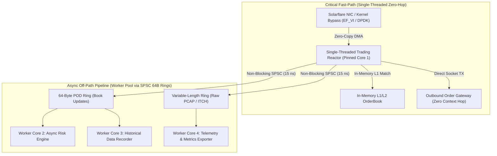

# HFT Evolution Roadmap: Ultra-Low-Latency Architecture (Zig 0.16 & Rust)

---

## Executive Summary & Engineering Thesis

In Tier-1 High-Frequency Trading (FX, Equities, Crypto Market Making) with sub-microsecond Tick-to-Trade constraints:
1. **The Critical Path MUST be Single-Threaded & Zero-Hop:** Multi-threaded worker pools are eliminated from the direct order-execution loop because inter-core cache synchronization (L3 cacheline invalidation via MESI/MOESI) imposes an unavoidable **100–300 ns physical penalty**.
2. **Fixed 4KB Payloads MUST Evolve to 64-Byte Flat Cacheline PODs & Variable Slices:** Passing 4264-byte generic frames for 32-byte market updates consumes excessive memory bandwidth (~4.2 GB/s per 1M msg/s).
3. **Hardware Microarchitecture & CPU Hints Eliminate Tail Latency (Jitter):** Software locks and branch mispredictions are only part of the problem. TLB misses (30–60 ns), cold L1D cache misses (100–200 cycles), and minor page faults (1.5–3.0 µs) cause catastrophic p99.9 latency spikes. Hardware prefetching, 2MB/1GB HugePages, prefaulting, and `@branchHint` must be baked into the foundational memory layer.
4. **The Role of the Async Worker Pool:** The pool serves as the **Asynchronous Off-Path Pipeline** (Order Book Rebuilders, Multi-Asset Risk Engines, Real-time Logging, and Prometheus Telemetry), decoupled from the Reactor core via lock-free, zero-CAS SPSC rings.

---

## Architecture Topology



---

## Evolution Phases & Implementation Milestones

### Phase 1: Hardware-Level Hardening, CPU Hints & Zero-TLB Memory Subsystem
**Status:** `[x] COMPLETED & VERIFIED` (See full specification: [`docs/PHASE1_HARDWARE_SPECIFICATION.md`](PHASE1_HARDWARE_SPECIFICATION.md))

> **Priority Goal:** Eliminate tail latency jitter spikes (p99/p99.9) by optimizing hardware cache residency, page translation, and CPU instruction pipelines.

#### 1. Hardware Prefetching (`@prefetch`)
- **Problem:** When a worker finishes processing slot `pos`, data for `pos + 1` resides in DRAM or L3, causing an L1 Data Cache Miss (~100–200 CPU stall cycles).
- **Solution:** Issue programmatic hardware prefetch hints 1–2 slots ahead:
  ```zig
  // Prefetch next ring cell directly into L1D cache
  const next_pos = pos + 1;
  const next_cell = &ring.cells[next_pos & ring.mask];
  @prefetch(next_cell, .{ .rw = .read, .locality = 3, .cache = .data });
  ```
- **Verification Check:** Eliminate memory stall cycles during ring traversal; verified via `perf stat -e L1-dcache-load-misses`.

#### 2. Translation Lookaside Buffer (TLB) & 2MB/1GB HugePages
- **Problem:** A 256MB ring buffer backed by standard 4KB OS pages spans 65,536 page table entries, overwhelming the L1/L2 DTLB (1024–1536 entries) and causing 4-level Page Table Walks (`CR3` $\to$ `PML4` $\to$ `PDP` $\to$ `PD` $\to$ `PTE`) with a **30–60 ns penalty per miss**.
- **Solution:** Allocate ring slabs backed by 2MB HugePages (or 1GB HugePages on dedicated servers):
  ```zig
  // Linux 2MB HugePages allocation with anonymous mmap
  const slab = try std.posix.mmap(
      null,
      ring_size_bytes,
      std.posix.PROT.READ | std.posix.PROT.WRITE,
      .{ .TYPE = .PRIVATE, .ANONYMOUS = true, .HUGETLB = true },
      -1,
      0,
  );
  ```
- **Verification Check:** 256MB fits into just 128 TLB entries; 0 DTLB misses verified via `dTLB-load-misses`.

#### 3. Branch Prediction Hints (`@branchHint`)
- **Problem:** Branch mispredictions on queue overflow checks (`EAGAIN`) flush the CPU instruction execution pipeline (~15–20 cycles penalty).
- **Solution:** Linearize the assembly instructions so the hot path executes branch-free:
  ```zig
  if (@branchHint(.unlikely, ring.isClosed())) {
      return error.PoolClosed;
  }
  ```
- **Verification Check:** Zero pipeline flushes on hot-path loops; confirmed via `perf stat -e branch-misses`.

#### 4. Memory Prefaulting & `mlockall` (Zero Page Faults)
- **Problem:** Demand paging in Linux triggers Minor Page Faults (1.5–3.0 µs kernel trap) on first memory access.
- **Solution:** Call `mlockall(MCL_CURRENT | MCL_FUTURE)` and write zero bytes across all allocated pages during initialization:
  ```zig
  // Touch every 4KB/2MB page during startup to force physical page allocation
  var offset: usize = 0;
  while (offset < slab.len) : (offset += 4096) {
      slab[offset] = 0;
  }
  try std.posix.mlock(slab);
  ```
- **Verification Check:** 0 runtime page faults verified via `perf stat -e page-faults`.

---

### Phase 2: Generic 64-Byte Cacheline POD Ring (`comptime SpscRing(T)`) — `[COMPLETED]`

- **Objective:** Eliminate payload padding for fixed financial data structures and eliminate memory bandwidth pressure.
- **Implementation:**
  ```zig
  pub const BookUpdate64 = extern struct {
      timestamp_ns: u64,   // 8B: Monotonic hardware cycle timestamp
      seq: u64,            // 8B: Global exchange sequence number
      symbol_id: u32,      // 4B: Integer ticker identifier (e.g., BTCUSDT = 1)
      flags: u32,          // 4B: Event flags (Snapshot, Delta, Trade)
      bid_price: f64,      // 8B: Top of Book Bid Price
      bid_qty: f64,        // 8B: Top of Book Bid Quantity
      ask_price: f64,      // 8B: Top of Book Ask Price
      ask_qty: f64,        // 8B: Top of Book Ask Quantity
      _reserved: [8]u8 = [_]u8{0} ** 8, // 8B: Padding to exactly 64B (1 Cache Line)
  };
  
  pub fn SpscRing(comptime T: type, comptime capacity: usize) type {
      // Compile-time power-of-two assertions, 64-byte aligned slabs, HugePage backing
  }
  ```
- **Verified Benchmark Results:**
  - Throughput: **28.54 Million ops/sec** (BookUpdate64) / **161.42 Million ops/sec** (Pure SPSC)
  - Latency: **35.03 ns** (BookUpdate64) / **6.20 ns** (Pure SPSC)
  - Bandwidth: **64 MB/s** per 1M msg/s (98.5% reduction vs 4.26 GB/s)
  - Memory Alignment: Strictly `align(64)` for zero false sharing and zero split-cacheline penalties.
- **Rust FFI Bindings:** Exposes `BookUpdate64` and `Trade64` structs with `#[repr(C, align(64))]` and verified `payload_as::<T>()` zero-copy extraction.

---

### Phase 3: Variable-Length Zero-Copy Ring (Bipartite Buffer & BipRing) — `[COMPLETED]`

- **Objective:** Ultra-fast streaming of arbitrary payload sizes (64B to 1500B MTU and up to 64KB) without buffer fragmentation, memcpy split-wrapping, or 4KB slot waste.
- **Microarchitecture:**
  - **Bipartite Circular Buffer (`BipBuffer`):** Circular memory arena that guarantees 100% physically contiguous zero-copy memory slices for both producer and consumer. When a variable-length packet does not fit in the remaining space at the end of the buffer (Region A), the producer wraps the entire contiguous packet to the beginning of the buffer (Region B), eliminating memory fragmentation and boundary split memcpy.
  - **Descriptor-Indexed Packet Ring (`BipRing`):** Couples the variable-length BipBuffer payload storage with a lock-free 16-byte `PacketDescriptor` SPSC ring (`timestamp_ns: u64`, `offset: u32`, `len: u32`), enabling discrete packet boundary delivery with zero parsing overhead.
  - **Memory Separation & Atomic Synchronization:** Cacheline-aligned separation (`align(64)`) of producer write state and consumer read state to eliminate false sharing.
- **Verified Benchmark Results:**
  - Throughput: **`14.21 Million packets/sec`**
  - Latency: **`70.38 ns`** per packet
  - Payload Sizes tested: 64B, 128B, 256B, 512B, 1024B, 1400B (MTU Ethernet frames)
- **Rust FFI Bindings:**
  - `awp_zig_rs::BipBuffer`: Direct byte-level Zero-Copy `reserve(&mut self, size) -> Option<&mut [u8]>`, `commit(&mut self, size)`, `peek(&self) -> Option<&[u8]>`, `consume(&mut self, size)`.
  - `awp_zig_rs::BipRing`: Packet-level streaming `push_packet(&mut self, payload: &[u8], timestamp_ns: u64) -> bool` and `pop_packet(&mut self) -> Option<PacketView<'_>>`.
  - `awp_zig_rs::PacketView`: Zero-copy typed accessor for payload slice and ingress nanosecond hardware timestamp.

---

### Phase 4: Hybrid Fast-Path & Off-Path Worker Architecture

- **Objective:** Decouple order execution from analytics and compliance.
- **Components:**
  1. **Core 1 (Trading Reactor):** Pinned performance core running zero-syscall loop.
  2. **Core 2–4 (Worker Pool):** Sharded worker pool consuming from dedicated SPSC rings for parallel portfolio risk checks, audit logging, and book depth aggregations.

---

### Phase 5: Kernel Bypass Ingress Integration & NUMA Pinning

- **Objective:** Direct NIC-to-Ring DMA with local socket memory.
- **Protocols Supported:**
  - Linux: Solarflare EF_VI / OpenOnload, DPDK, `io_uring` with `IORING_SETUP_SQPOLL`.
  - macOS: Raw BSD socket polling and Apple Network.framework Zero-Copy slabs.
- **NUMA Local Allocation:** Enforce ring allocation on the specific NUMA node matching the pinned CPU core (`mbind` / `numa_alloc_onnode`).
- **Vectorized Parsing (AVX-512 / ARM Neon):** Single-instruction parsing of binary ITCH/FIX protocol feeds.
