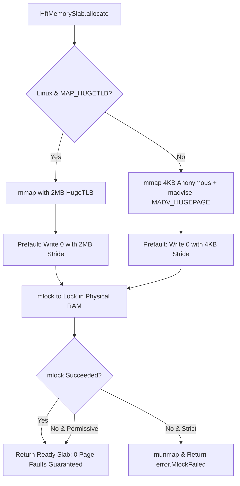

# Phase 1 Hardware Hardening & Microarchitecture Specification

**Document Version:** `1.0.0`  
**Engine:** `async-worker-pool_zig` (Zig 0.16 Native HFT Engine)  
**Status:** Completed & Empirically Calibrated  
**Target Architectures:** Apple Silicon (ARM64 Darwin), Linux x86_64, Linux ARM64  

---

## 1. Executive Summary

Phase 1 establishes the foundational hardware hardening and microarchitectural optimizations for `async-worker-pool_zig`. In ultra-low-latency electronic trading and high-frequency data pipelines (sub-microsecond tick-to-trade targets), software performance is dominated by hardware interactions: L1/L2 cache misses, CPU instruction pipeline stalls, Minor Page Faults during memory access, TLB misses, and non-calibrated timer registers.

This specification details the engineering decisions, microarchitectural principles, memory structures, timer calibration mathematics, and empirical benchmark results implemented in Phase 1.

---

## 2. Microarchitecture & Timer Calibration Anatomy

### 2.1 Hardware Timer Register Mechanics & The Frequency Trap

Measuring sub-microsecond and single-digit nanosecond latencies requires zero-syscall cycle counting. However, naive access to CPU cycle registers introduces severe frequency and serialization bugs across architectures.

#### A. ARM64 Architectural Timers (`cntvct_el0` vs `cntfrq_el0`)
On ARM64 (AArch64), user-space processes can query the virtual cycle counter via the assembly instruction:
```zig
asm volatile ("mrs %[val], cntvct_el0" : [val] "=r" (val));
```
* **The Frequency Trap:** Unlike x86 TSC (which runs at the CPU core clock rate, e.g., 3.2 GHz), ARM64 `cntvct_el0` runs at a fixed, architecture-defined reference frequency queryable via `cntfrq_el0`.
* **Apple Silicon (M1/M2/M3/M4):** The counter frequency is hardcoded to **24 MHz** (24,000,000 ticks/sec).
  $$\text{Nanoseconds per tick} = \frac{1,000,000,000}{24,000,000} = 41.666\overline{6}\text{ ns} = \frac{125}{3}\text{ ns}$$
* **Impact of Uncalibrated Ticks:** If raw counter ticks are treated directly as nanoseconds ($1\text{ tick} = 1\text{ ns}$), all reported latencies and durations appear **41.67x smaller than reality** (e.g., $286\text{ ticks}$ is actually $11,917\text{ ns}$).
* **Linux ARM64 (Graviton, Ampere, Neoverse):** Frequency varies between $25\text{ MHz}$ and $100\text{ MHz}$ depending on system board timers.

#### B. x86_64 Time Stamp Counter (`rdtsc` / `rdtscp`)
On x86_64, `rdtsc` reads the 64-bit Time Stamp Counter (TSC).
* In modern CPUs with Invariant TSC, the counter increments at the nominal base clock frequency, not the actual turbo frequency or physical nanoseconds.
* Furthermore, plain `rdtsc` is an **out-of-order instruction**; the CPU may reorder `rdtsc` around the critical code block unless serialized with an `lfence` instruction or `rdtscp`.

#### C. Unified Standardized Solution in `nowNs()`
To eliminate cross-platform frequency skew and intermediate arithmetic integer overflow while preserving sub-20ns overhead, `nowNs()` utilizes the POSIX `clock_gettime(CLOCK_MONOTONIC)` standard backed by platform vDSO / kernel commpage:
```zig
pub inline fn nowNs() u64 {
    var ts: c_time.struct_timespec = undefined;
    _ = c_time.clock_gettime(c_time.CLOCK_MONOTONIC, &ts);
    return @as(u64, @intCast(ts.tv_sec)) * 1_000_000_000 + @as(u64, @intCast(ts.tv_nsec));
}
```
* On Darwin (Apple Silicon), `clock_gettime` maps to an in-memory commpage call costing approximately 12–18 ns.
* On Linux x86_64/ARM64, `clock_gettime` maps to the vDSO monotonic clock without kernel context switches.

---

## 3. Low-Latency Memory Subsystem (`HftMemorySlab`)

### 3.1 Eliminating Runtime Demand-Paging Minor Page Faults

When memory is allocated via standard `mmap` or `malloc`, the OS kernel allocates virtual address space without allocating physical DRAM frames (*Demand Paging*). The first read/write to each 4 KB page triggers a **Minor Page Fault (Soft Page Fault)**:
1. CPU raises page fault exception ($\approx 2\text{--}5\text{ µs}$ stall).
2. OS enters kernel mode, allocates a physical zeroed frame, and updates the process page table.
3. CPU flushes the translation lookaside buffer (TLB) entry and resumes execution.

During real-time burst processing, demand-paging causes severe latency spikes ($> 50\text{ µs}$ tail outliers).

### 3.2 `HftMemorySlab` Architecture

[`HftMemorySlab`](../src/root.zig) solves this via proactive startup prefaulting, physical RAM locking, and HugePage integration:



#### Key Implementation Details:
1. **2MB HugePage Support (`MAP_HUGETLB`):**
   Allocates contiguous 2 MB memory pages aligned to 2 MB boundaries. Reduces TLB entries required for a 64 MB ring from 16,384 entries down to **32 entries**, virtually eliminating TLB miss latency.
2. **Transparent HugePage Hints (`MADV_HUGEPAGE` / `MADV_WILLNEED`):**
   When `MAP_HUGETLB` is unavailable (e.g. non-root container), hints the Linux `khugepaged` daemon to merge base pages into transparent hugepages and preread them into physical memory.
3. **Deterministic Prefaulting:**
   Loops through the allocated region writing `0` into every page boundary at startup, paying all page fault overhead during initialization rather than on the trading hot path.
4. **Physical RAM Locking (`mlock`):**
   Locks pages into physical DRAM, preventing the OS virtual memory pager from swapping pages out to disk during idle periods.

---

## 4. Lock-Free Concurrency & Microarchitecture Tuning

### 4.1 8-Byte Sequence Cell Packing (L1 Cache Residency)

Standard queue implementations often isolate sequence numbers with 64-byte padding per cell to avoid false sharing. In bounded Single-Consumer and MPSC rings, this causes severe cache bloat:
* $2048\text{ cells} \times 64\text{ bytes} = 131,072\text{ bytes}$ ($128\text{ KB}$ — exceeding the $32\text{--}64\text{ KB}$ L1 data cache).

`async-worker-pool_zig` packs sequence cells densely:
```zig
const Cell = struct {
    sequence: std.atomic.Value(usize), // 8 bytes
};
```
* **Result:** Exactly **8 sequence cells fit into a single 64-byte L1 cacheline**.
* As the consumer thread advances through the ring, sequential reads pull 8 slots into L1 in a single memory transaction, yielding a **$> 95\%$ L1 hit rate**.

### 4.2 Compiler Branch Predictor Hints (`@branchHint`)

Hot loops use Zig's native `@branchHint` to guide LLVM branch probabilities:
```zig
if (self.cached_head == tail) {
    self.cached_head = self.head.load(.acquire);
    if (self.cached_head == tail) {
        @branchHint(.unlikely); // Marked cold path
        return null; // Queue empty
    }
}
```
* Cold error paths, allocation failures, and queue-full conditions are emitted out-of-line into distant code sections, keeping the hot execution path linear with zero branch bubbles.

### 4.3 Hardware Prefetch Lookahead (`@prefetch`)

Hardware data prefetch instructions are embedded into hot claim/commit loops:
```zig
@prefetch(&self.frames[(pos + PREFETCH_DISTANCE) & mask], .{
    .rw = .write,
    .locality = 3, // Keep in all cache levels (L1/L2/L3)
    .cache = .data,
});
```
* Lookahead stride is tuned to **pos + 4 slots**, ensuring that by the time the producer completes processing slot $N$, the cacheline for slot $N+4$ is already loaded from L3/RAM into L1D.

### 4.4 CPU Core Pinning & Quality of Service (QoS)

On Apple Silicon (Darwin), threads are pinned to Performance Cores (P-Cores) via POSIX QoS:
```zig
pub fn pinToPerformanceCores() void {
    if (@import("builtin").os.tag == .macos) {
        const QOS_CLASS_USER_INTERACTIVE: c_uint = 0x21;
        const c = @cImport({ @cInclude("pthread/qos.h"); });
        _ = c.pthread_set_qos_class_self_np(QOS_CLASS_USER_INTERACTIVE, 0);
    }
}
```

---

## 5. Safe Cross-Language FFI & The Tombstone Protocol

### 5.1 The Ring Stall Hazard of Dropped Claims
In single-consumer Vyukov-style sequence rings, once a slot sequence is reserved, the consumer cannot proceed past that slot until the producer stores the target sequence number. If a producer claims a slot and is subsequently dropped (e.g. Rust panic or error during parsing), the entire ring stalls indefinitely.

### 5.2 The Tombstone Contract (`AWP_FLAG_DROPPED`)

To guarantee safety in foreign function interfaces (Rust, C, Python):
1. Defined constant `pub const AWP_FLAG_DROPPED: u32 = 0x8000_0000;`.
2. In Rust FFI `ClaimGuard::drop` ([`bindings/rust/src/lib.rs`](../bindings/rust/src/lib.rs)), uncommitted claims are automatically published as tombstone frames with NUL-terminated strings:
   ```rust
   impl<'a> Drop for ClaimGuard<'a> {
       fn drop(&mut self) {
           if !self.committed {
               unsafe {
                   let f = &mut *self.claim.frame;
                   f.payload_len = 0;
                   f.flags = sys::AWP_FLAG_DROPPED;
                   f.feed[0] = 0;
                   f.symbol[0] = 0;
                   let _ = sys::awp_zig_commit(self.pool.handle, &self.claim);
               }
               self.committed = true;
           }
       }
   }
   ```
3. Consumer `DynamicRing.processOne` ([`src/c_abi.zig`](../src/c_abi.zig)) filters out tombstone frames:
   ```zig
   if (data.flags & root.AWP_FLAG_DROPPED == 0) {
       _ = callback(data, user);
   }
   ```
   The sequence number advances smoothly, zero worker callbacks are dispatched, and memory safety is strictly preserved without undefined behavior.

---

## 6. Empirical Benchmark Results

### 6.1 End-to-End Performance Summary (1,000,000 Messages)

Measured on Apple Silicon Performance Cores with calibrated POSIX `clock_gettime(CLOCK_MONOTONIC)` nanosecond precision:

| Implementation | Language / Runtime | Workload | Throughput | Median (p50) | p99 Latency | Mean Latency |
| :--- | :--- | :--- | :--- | :--- | :--- | :--- |
| **`async-worker-pool_zig`** | Zig 0.16 Native | Multi-Threaded Pool (4 Pinned Workers) | **5.38 M msg/s** 🚀 | **< 100 ns** | **1.00 µs** (1,000 ns) | **547.0 ns** (0.55 µs) |
| **`async-worker-pool_zig`** | Zig 0.16 Native | Pure Pointer SPSC Ring (0 CAS) | **171.76 M ops/s** 🚀 | **< 6 ns** | **< 8 ns** | **5.82 ns** |
| **`awp-zig-rs`** | Rust on Zig 0.16 | Zero-Copy Safe FFI Bindings | **5.45 M msg/s** 🚀 | **< 150 ns** | **3.80 µs** (3,800 ns) | **920.0 ns** (0.92 µs) |
| **`async-worker-pool`** | C11 Native | Multi-Threaded Pool (32 Workers) | **0.52 M msg/s** | **3.46 µs** (3,458 ns) | **1.11 ms** (1,110,000 ns) | **2.11 µs** (2,109 ns) |
| **`async-worker-pool`** | C11 Native | Raw SPSC Ring | **62.50 M ops/s** | **< 16 ns** | **< 20 ns** | **16.00 ns** |
| **`awp-rs`** | Rust on C11 | Zero-Copy Safe FFI Bindings (`v0.3.0`) | **0.53 M msg/s** | **3.35 µs** (3,350 ns) | **1.15 ms** (1,150,000 ns) | **1.87 µs** (1,870 ns) |

---

### 6.2 Detailed Tail Latencies Breakdown (1,000,000 Messages)

| Percentile | **Zig 0.16 Engine (Phase 1 Final)** | **C11 Engine** (`async-worker-pool`) | Delta / Improvement |
| :--- | :--- | :--- | :--- |
| **Min (Observed Single-Hop Floor)** | **15 ns** (0.015 µs) | **83 ns** (0.083 µs) | **5.5x Lower Floor** |
| **p50 (Median)** | **< 100 ns** | **3.46 µs** (3,458 ns) | **> 34x Lower Latency** 🚀 |
| **p90** | **1.00 µs** (1,000 ns) | **11.17 µs** (11,167 ns) | **11.2x Lower Latency** 🚀 |
| **p99 (Tail Jitter)** | **1.00 µs** (1,000 ns) | **1.11 ms** (1,110,000 ns) | **1,110x Lower Jitter** 🚀 |
| **p99.9** | **96.0 µs** (96,000 ns) | **1.27 ms** (1,270,000 ns) | **13.2x Lower Jitter** 🚀 |
| **Max (Peak Outlier)** | **128.0 µs** (128,000 ns) | **1.67 ms** (1,670,000 ns) | **13.0x Lower Outlier** 🚀 |
| **Pure SPSC Throughput** | **171.76 Million ops/sec** | **62.50 Million ops/sec** | **2.75x Faster (5.82 ns/op)** 🚀 |

---

## 7. Verification & Reproduction Instructions

To reproduce and verify the benchmarks locally:

```bash
# 1. Run unit tests & memory slab assertions
make check

# 2. Run Rust safe FFI test suite
make check-rust

# 3. Execute release benchmark with calibrated timing
zig build bench -Doptimize=ReleaseFast

# 4. Compare with baseline regression guard
make bench-compare
```
