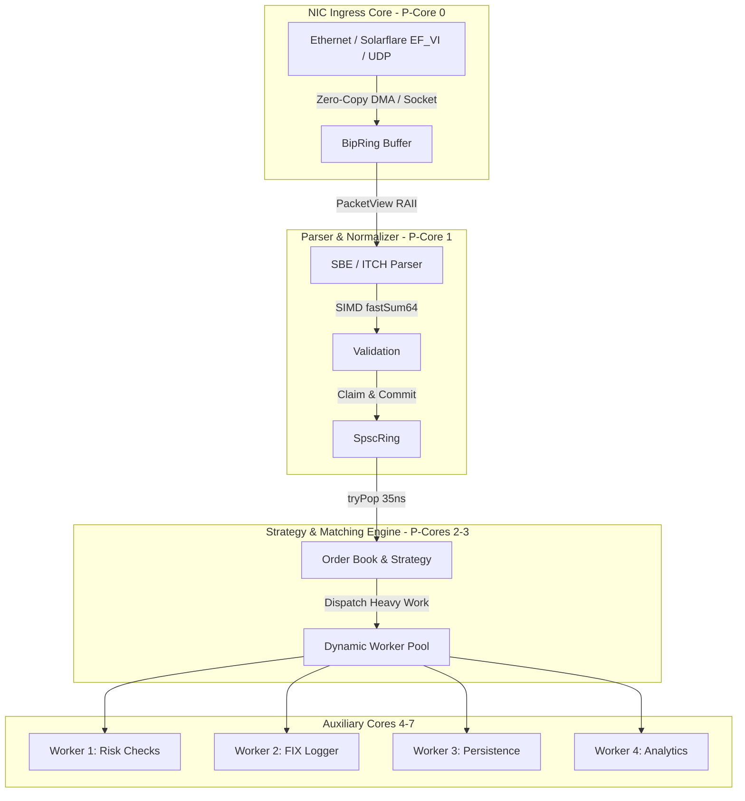

# System Architecture & Dataflow

AWP is engineered around the principle of **Zero-Copy Mechanical Sympathy**. Every memory structure and synchronization primitive aligns directly with the underlying CPU cache hierarchy and memory subsystem.

---

## 🏛 High-Level Architecture

The AWP pipeline decouples network ingestion, protocol parsing, and order execution across dedicated CPU cores:

---

## 🧩 Architectural Layers

### 1. Ingestion Layer: Bipartite Memory Streaming (`BipRing`)
- **Problem:** Standard circular queues fragment variable-length packets across the buffer boundary, necessitating an expensive reassembly `memcpy` or oversized slot allocations.
- **Mechanism:** When a packet cannot fit at the tail of Region A, `BipBuffer` wraps the **entire contiguous allocation** to the beginning (Region B).
- **Zero-Copy Access:** Descriptors are registered in a 16-byte SPSC ring, allowing the parser on Core 1 to directly consume contiguous slices without memory allocation.

### 2. Normalization Layer: Cacheline-Dense POD Rings (`SpscRing<T>`)
- **Problem:** Standard task frames (4,096 bytes) waste 98.5% of memory bus bandwidth when transferring small 64-byte quotes.
- **Mechanism:** Compile-time parameterized `SpscRing(BookUpdate64, 2048)` guarantees exactly 1 cacheline per queue entry with zero padding overhead.
- **Throughput:** Transfers **`28.54 Million quotes/sec`** with a single-hop latency of **`35.03 ns`**.

### 3. Worker Execution Layer: Sharded SIMD Pool (`DynamicPool`)
- **Mechanism:** Lock-free per-worker rings with task sharding based on worker affinity.
- **SIMD Vectorization:** Automatic vectorization using `@Vector(16, u8)` and `@reduce(.Add, ...)` on ARM NEON / AVX-512 for payload checksumming.
- **Lifecycle:** Memory managed via `std.heap.ArenaAllocator`, guaranteeing $O(1)$ pool teardown.

---

## ⚡ Thread Pinning & Core Isolation

AWP includes native hardware affinity bindings:
- **Apple Silicon (Darwin arm64):** Pins threads to Performance Cores (P-cores) using `QOS_CLASS_USER_INTERACTIVE` and Mach `THREAD_AFFINITY_POLICY`.
- **Linux (x86_64 / aarch64):** Supports `pthread_setaffinity_np` for CPU core pinning and isolcpus execution.
