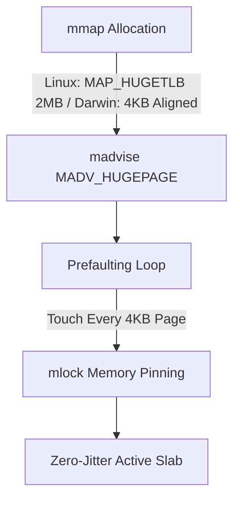

# Hardware Hardening & HugePages (`HftMemorySlab`)

In sub-microsecond trading systems, dynamic page faults and Translation Lookaside Buffer (TLB) cache misses are major sources of latency spikes and non-deterministic jitter.

`HftMemorySlab` is AWP's zero-jitter memory allocator backing all core ring structures.

---

## 🛑 The TLB Miss & Page Fault Bottleneck

- **Standard 4KB Pages:** A 64MB buffer requires 16,384 distinct page table entries. Under heavy random access, the CPU L1/L2 TLB caches are constantly evicted, triggering slow multi-level hardware page table walks (50–150 ns penalty per miss).
- **Minor Page Faults:** Linux and macOS allocate virtual memory lazily on `mmap`. The first write to an untouched page triggers a CPU interrupt and OS kernel fault handler (1–5 µs latency spike).

---

## ⚡ `HftMemorySlab` Architecture

`HftMemorySlab` eliminates jitter through a four-stage allocation protocol:



1. **2MB HugePage Mapping:** Uses `MAP_HUGETLB` on Linux and `MADV_HUGEPAGE` to collapse 512 standard pages into a single 2MB TLB entry, reducing TLB footprint by **99.8%**.
2. **Startup Prefaulting:** Explicitly touches every 4KB page chunk at initialization:
   ```zig
   var offset: usize = 0;
   while (offset < final_size) : (offset += BASE_PAGE_SIZE) {
       raw.?[offset] = 0;
   }
   ```
   Ensures **0 Minor Page Faults** during production execution.
3. **Memory Locking (`mlock`):** Pins memory in physical RAM, preventing the OS kernel from paging or swapping memory regions to disk.

---

## 🛠 Backing Rings with HugePages

All AWP rings support direct slab initialization:

```zig
// 1. Allocate a 64MB zero-fault HugePage slab
var slab = try awp.HftMemorySlab.allocate(64 * 1024 * 1024);
defer slab.deallocate();

// 2. Back the 64-byte POD ring directly with HugePage memory
var ring = try awp.SpscRing(awp.BookUpdate64, 8192).initSlab(&slab);
defer ring.deinit();
```
